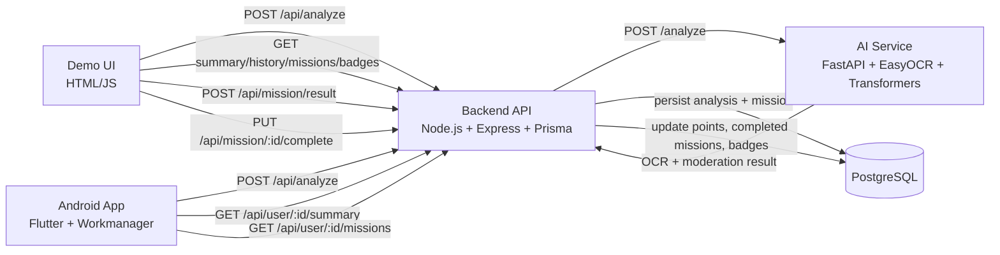

# AI Module to Turn Screen Time into Real Learning

Full technical documentation for the PFE project: a parental control platform that analyzes screenshots, detects risky content with local AI, and turns outcomes into age-aware educational missions and gamified progression.


## 1) Project Purpose

This system transforms passive screen time into guided real-world learning:

- analyzes screenshot content with OCR and AI moderation
- detects potentially harmful or inappropriate signals (text + visual)
- generates missions based on risk level
- uses reward logic, parent validation, badges, and levels to drive healthy behavior
- keeps the backend/AI contract stable for reliable integration

### 1.1) Roadmap and AI capability summary

Sprint-style progress and **next AI priorities** are tracked in **[ROADMAP.md](ROADMAP.md)**.

**Delivered and validated (stable in pipeline):** **Arabic OCR + Tunisian dialect risk detection** — COMPLETED · TESTED · STABLE · INTEGRATED (`analysis_orchestrator` + `dialect_utils`).

**AI module capabilities today:**

- **OCR languages (EasyOCR):** **English + Arabic** in one reader (`fr` cannot be combined with `ar` in the same `lang_list` per EasyOCR). French on-screen text may still appear as Latin where the detector generalizes.
- **Dialect-aware moderation (heuristic):** Arabizi-style normalization; digit-to-letter mapping (e.g. **3→ع**, **7→ح**); Tunisian risky-token dictionary; where Arabizi typing uses **9** for **ق** in fixed expressions (e.g. **قحبة**), **whole-token normalization** in `dialect_utils` applies; keyword flag **`tunisian_dialect_risk`**; **+0.1** text risk bump **bounded to 1.0**; then **fusion with vision** via `max`.
- **Risk scoring:** text (moderation + optional dialect bump) + vision; **keyword explainability** in API payloads; downstream **missions / gamification** driven by backend rules from `riskScore` / `category`.

**Dialect layer constraints:** does **not** change `moderate()` or internal moderation logic; **only augments** copied keyword list and text risk before vision fusion; **deterministic**, **fast**, compatible with **frozen** `ModerationResult`.

## 2) Architecture Overview



## 3) Repository Structure

- `backend/`: Express API, business logic, Prisma schema/migrations/seed, Jest tests
- `ai-service/`: FastAPI OCR + moderation + vision service, evaluation script, pytest tests
- `demo/`: single-page HTML interface to exercise the full flow
- `android-app/`: Flutter Android client that monitors foreground usage stats, captures the screen (MediaProjection), compresses, and uploads `POST /api/analyze` in the background — see [`android-app/README.md`](android-app/README.md) (vendored `media_projection_creator` + patched `media_projection_screenshot` for Android 14/15, including one reused `VirtualDisplay` per session for repeated `takeCapture` and explicit native `resetSession()` for re-consent recovery; captures all foreground apps except launcher/home; overlap guard; lifecycle pause/resume for battery; hourly capture cap; balanced projection auto-recovery with re-consent fallback; risk-adaptive interval via persisted worker policy; hardened handling for `Must request permission before take capture` with a short post-consent stabilization delay; manifest `FOREGROUND_SERVICE_MEDIA_PROJECTION`; scroll-safe layout when the keyboard is open).
- `scripts/`: cross-stack test runner (`run-all-tests.js`, `run_tests.sh`)
- `.husky/`: pre-commit test hook
- **[ROADMAP.md](ROADMAP.md)**: PFE sprint/feature status, AI pipeline reference, next priorities

## 4) End-to-End Functional Pipeline

1. Client sends `POST /api/analyze` with `{ userId, age, image? }`.
2. If no image is provided, backend returns a safe preview (`riskScore: 0`) and does not persist analysis.
3. If image is present, backend calls AI service `/analyze`.
4. AI service decodes base64 image and runs the **on-device AI pipeline** (see §6 and [ROADMAP.md](ROADMAP.md)):
   - **OCR extraction** (EasyOCR **en / ar**; `fr` omitted — not supported together with `ar` in EasyOCR)
   - **Text moderation** (zero-shot classifier, rule fallback on failure) — core logic unchanged by dialect layer
   - **Dialect normalization + Tunisian / Arabizi keyword detection** (`dialect_utils`) — heuristic, deterministic, low-latency; optional augment only
   - **Text risk adjustment** if dialect hits: **`tunisian_dialect_risk`** + canonical terms; **+0.1** to text risk **capped at 1.0**
   - **Fusion with vision** — `max(adjusted_text_risk, vision_risk)` and merged keywords
5. AI result is normalized to:
   - `text`, `displayText`, `matchedKeywords`, `riskScore`, `category`
6. Backend creates `Analysis` + `Mission` (legacy text + optional structured interactive content).
7. Mission personalization uses user profile (`interests`, `engagementScore`, `age`) with risk-aware routing.
8. Points logic:
   - safe `real_world` missions (`riskScore < 0.3`): immediate points only if cooldown + daily cap allow it
   - interactive missions (`quiz`, `puzzle`, `mini_game`): points awarded via `POST /api/mission/result` using `base + bonus`
   - parent completion endpoint keeps `completedMissions` logic and avoids double-point award for interactive missions
9. Badge logic runs on point, mission-completion, and age conditions.
10. Engagement score is recalculated after each submitted mission result from recent outcomes.
11. Parent dashboard endpoints expose history, missions, summary, and earned badges.
12. Demo Analyze tab can render interactive widgets for mission types (`quiz`, `puzzle`, `mini_game`) and submit outcomes to `/api/mission/result`.

## 5) Backend (Node.js / Express / Prisma)

### 5.1 Entrypoints and Routing

- `backend/server.js`: loads `.env`, starts Express on `PORT` (default `3000`)
- `backend/src/app.js`:
  - `cors`
  - `express.json({ limit: "15mb" })` (supports large base64 payloads)
  - `morgan("dev")`
  - mounts router under `/api`
- `backend/src/routes/index.js`:
  - `/api/health`
  - `/api/analyze`
  - `/api/user`
  - `/api/mission`

### 5.2 Analyze Flow

Main file: `backend/src/services/analyzeService.js`

- validates and normalizes AI payload
- mission generation (personalized):
  - `selectMissionType(user, riskScore, category)` uses:
    - dangerous risk (`> 0.7`):
      - `games` interest -> `mini_game`
      - low engagement (`< 0.4`) -> `mini_game`
      - otherwise -> `quiz`
    - medium risk (`0.3–0.7`):
      - interests (`games` -> `mini_game`, `reading` -> `quiz`)
      - low engagement (`< 0.4`) -> `mini_game`
      - younger children (`age < 10`) -> `puzzle`
      - otherwise -> `real_world`
    - safe risk (`<= 0.3`) -> `real_world`
  - `computeDifficulty(user)` returns `1..3` from `engagementScore`
- mission persistence includes:
  - `mission` (legacy string text)
  - `type`, `content`, `difficulty`, `points`
- no-image path:
  - returns preview mission (`status: "preview"`)
  - does not write DB rows
- image path:
  - **Exposure boost (CDC §4.4):** after the AI returns, the backend loads **1-hour** `getRecentExposureStats(userId, 60)`. If `exposureRate > 0.5` and the **original** `riskScore` is still below `DANGEROUS_THRESHOLD` (from `backend/src/config.js`, env `MODERATION_DANGEROUS_THRESHOLD`, default `0.85`, aligned with the Python service), mission routing uses an **adjusted** score `min(riskScore + 0.15, 0.99)` for `selectMissionType` / `generateMissionPayload`; the stored `Analysis.riskScore` remains the **unadjusted** model value. The JSON response includes `exposureBoost: boolean`.
  - transaction creates/loads user, creates `Analysis`, creates `Mission`
  - safe immediate reward respects:
    - `SAFE_POINTS_COOLDOWN_MINUTES`
    - `SAFE_POINTS_DAILY_CAP`
    - daily reset using `lastSafeResetDate`
  - awards point badges when points effectively increase

### 5.3 Mission Completion Flow

Main file: `backend/src/services/missionService.js`

- endpoint: `PUT /api/mission/:id/complete`
- transactional checks:
  - mission exists
  - mission is not already completed
- updates:
  - mission `status = "completed"`
  - user points `+= mission.points + bonusPoints`
  - user `completedMissions += 1`
- then awards:
  - point badges
  - mission badges
- interactive mission safeguard:
  - for `quiz`/`puzzle`/`mini_game`, this endpoint increments `completedMissions` but does not award points (points are awarded by result submission)

### 5.4 Mission Result Submission Flow

Main files:

- `backend/src/services/missionResultService.js`
- `backend/src/controllers/missionResultController.js`
- `backend/src/routes/missionResultRoutes.js`

- endpoint: `POST /api/mission/result`
- transactional behavior:
  - validates mission ownership and mission state
  - computes `bonusPoints` from mission type + result data (`score`, `success`, `timeSpent`) and caps by `reward.maxBonus` when provided
  - creates `MissionResult`
  - auto-completes mission (`status = "completed"`)
  - increments user `points` by `earnedPoints = reward.basePoints + bonusPoints` (fallback to `mission.points` if reward is absent)
  - increments `completedMissions` by 1
  - updates `engagementScore` using recent mission results
  - triggers point and mission badge awarding

### 5.4.1 Engagement Score Formula

After each `POST /api/mission/result`, backend fetches the latest 10 mission results and computes:

- `completionRate = successes / total`
- `successRate = successes / total` (currently same signal, kept separate for future weighting changes)
- `streakFactor = min(consecutiveSuccesses / 10, 1)`
- `engagementScore = 0.4*completionRate + 0.3*successRate + 0.3*streakFactor`

This score is stored on `User.engagementScore` and then reused by personalization/difficulty logic.

### 5.5 User Read Endpoints

Main file: `backend/src/services/userService.js`

- `GET /api/user/:id/history?take=&skip=`:
  - paginated analyses + missions
- `GET /api/user/:id/missions?take=&skip=`:
  - paginated missions
- `GET /api/user/:id/badges`:
  - all earned badges with metadata and `awardedAt`
- `GET /api/user/:id/summary`:
  - points
  - total missions
  - dangerous analyses count
  - average risk score
  - level fields:
    - `level = floor(sqrt(points / 100)) + 1`
    - `pointsToNextLevel = 100 * (baseLevel + 1)^2 - points`
  - triggers age badge awarding based on current `age`
- `GET /api/user/:userId/exposure-summary?window=`:
  - rolling **exposure frequency** over a time window (implementation: `backend/src/services/analyzeService.js` + Prisma `groupBy` on `Analysis.category`)
  - query `window`: `1h`, `24h` (default), or `7d` — invalid values return `400` with `Invalid window. Use 1h, 24h, or 7d.`
  - response: `userId`, `window`, `totalAnalyses`, `riskyCount`, `dangerousCount`, `exposureRate`, `categoryBreakdown` (counts per category), `trend` (`increasing` | `stable` | `decreasing`), `lastDangerousAt` (ISO string or `null`)
- `GET /api/user/:id/profile`:
  - compact profile payload for demo personalization controls:
    - `id`, `age`, `points`
    - `interests` (normalized string array)
    - `engagementScore`
- `PUT /api/user/:id/interests`:
  - request body: `{ "interests": ["games", "reading", ...] }`
  - accepts and persists only allowed values:
    - `games`, `reading`, `science`, `sports`, `art`, `music`, `technology`, `logic`, `creativity`
  - normalizes to lowercase and removes duplicates
- `PUT /api/user/:id/age`:
  - request body: `{ "age": 12 }` (JSON number, integer, `0`–`120`)
  - updates `User.age` and returns `{ success, user }` with the same compact profile fields as `GET /api/user/:id/profile`

### 5.6 Badge Service

Main file: `backend/src/services/badgeService.js`

- idempotent awarding with `createMany(..., skipDuplicates: true)`
- types:
  - `POINT`: threshold crossing from previous to new points
  - `MISSION`: threshold crossing from previous to new completed-mission count
  - `AGE`: range matching (`6-9`, `10-12`, `13-17`, `18+`)
- supports optional transaction client (`tx`) for atomic operations

### 5.7 Prisma and Data Layer

- Prisma client singleton:
  - `backend/src/config/prisma.js`
  - dev global reuse avoids client duplication during reload
- schema:
  - `backend/prisma/schema.prisma`
- migrations:
  - `backend/prisma/migrations/*`
- seed:
  - `backend/prisma/seed.js`
  - inserts/updates 14 badges idempotently

## 6) AI Service (FastAPI / EasyOCR / Transformers)

**Internal text pipeline (ordered):** screenshot / base64 image → **OCR** (`ocr_service.py`, en/ar) → **optional digit-ratio token filter** (`analysis_orchestrator.py`, default **on**) → **text moderation** (`moderation_service.py`) → **dialect normalization + keyword detection** (`dialect_utils.py`) on the **same filtered string** → bounded **+0.1** text-risk augment when matched → **vision** (`vision_service.py`) → **max** fusion and category (`analysis_orchestrator.py`). Dialect is **heuristic**, **deterministic**, and **fast**; it does not mutate frozen moderation outputs—only **post-process copies** in the orchestrator.

### 6.1 Entrypoint and API Contract

Main file: `ai-service/app/main.py`

- `POST /analyze` input:
  - `{ "image": "<base64>" }`
  - accepts raw base64 and `data:image/...;base64,...`
- response contract (stable):

```json
{
  "text": "string",
  "displayText": "string",
  "matchedKeywords": ["string"],
  "riskScore": 0.82,
  "category": "safe | risky | dangerous | educational",
  "educationalScore": 0.0
}
```

(Additive field **`educationalScore`** — max NLI score for educational/learning hypotheses before orchestrator fusion. When the Node backend skips AI for preview/no-image, treat **`educationalScore` as `0.0`**; the FastAPI service returns **400** if `image` is missing or empty, so there is no separate “neutral” JSON path here.)

- `GET /health`: liveness check

### 6.2 Startup Behavior

At startup (`@app.on_event("startup")`):

- logs torch and CUDA availability
- attempts CUDA warmup
- preloads EasyOCR reader (best-effort)
- initializes moderation model synchronously with timeout
- if model init fails:
  - service still runs in degraded mode
  - moderation falls back to deterministic rule engine

### 6.3 OCR Layer

Main file: `ai-service/app/services/ocr_service.py`

- EasyOCR **single** reader: `["en", "ar"]` only (EasyOCR does **not** allow `ar` with `fr` in the same `lang_list`; first run may download Arabic weights, typically tens–low hundreds of MB)
- **`verbose=False`** on the reader reduces console noise
- **GPU** when `torch.cuda.is_available()` and `gpu=True` is passed to EasyOCR
- Image **thumbnail** to `1280x1280` before OCR to bound memory and time
- **Output:** unique words from all detections, **case-insensitive**, **first-seen order** (OCR box order, then word order within each box); duplicates skipped without reordering
- **Digit-heavy token filter:** implemented in `ocr_text_cleanup.py`, applied from `analysis_orchestrator.py` before moderation and dialect detection. A token is **kept** if it is **all digits** (e.g. long codes) or if `digits/len(word) <= OCR_DIGIT_RATIO_THRESHOLD` (default **0.4**). Otherwise it is dropped—trimming garbled OCR (e.g. `100k`, `m54`, `80u2el`) that can confuse zero-shot NLI, while keeping typical Arabizi/Latin words and pure-numeric tokens. Disable with `ENABLE_OCR_CLEANUP=false` if needed; tune via `OCR_DIGIT_RATIO_THRESHOLD`.
- **Degraded mode:** if EasyOCR fails to construct the reader (e.g. download error), startup continues; `extract_text` returns `""` and `/ready` reports `ocr_loaded: false`; **vision + text moderation** still run on the pipeline (moderation sees empty OCR unless text arrives from other paths)
- **French OCR:** not supported in this reader. **French (or other Latin) text** that still appears in OCR output can be passed through as tokens the moderation model may partially handle. The architecture could add **French via a second EasyOCR reader** in a future change if product needs it.

### 6.3.1 Tunisian dialect support (heuristic)

Main file: `ai-service/app/services/dialect_utils.py` (invoked from `analysis_orchestrator.py` on the OCR string **after** optional digit-ratio cleanup).

- **Risk-only Latin lexicon:** `ai-service/data/tunisian_dialect.json` lists **risky** Latin/Arabizi spellings and their Arabic canonical forms (loaded once, lazily). The effective Arabic risk set is the in-code baseline **∪** all `arabic` values from that file (no benign general vocabulary in this file).
- **Digit normalization:** Latin digits mapped to Arabic letters (single canonical table) for Arabizi-style typing.
- **Yamli-style `PATTERN_MAP`:** multi-letter Latin fragments (e.g. `ch`→`ش`, `gh`→`غ`) are applied **only** when the token contains at least one Arabizi digit, so plain English words like `school` are not rewritten.
- **Latin fragments:** minimal suffix/prefix replacements applied only when the token already starts with an Arabic letter after digit mapping (limits false positives on pure English).
- **Whole-token map:** a small set of Arabizi spellings that would be wrong under the digit table alone (e.g. `9ahba` → `قحبة`) are handled explicitly in code (also present in JSON for lookup).
- **Detection pipeline (per token):** (1) exact lowercase match on JSON Latin keys; (2) else `normalise_word` and check against the **effective** Arabic risk set; (3) else `difflib.get_close_matches` on Latin keys (`cutoff` **0.8**) to tolerate minor OCR/Latin typos. A hit adds the **canonical Arabic** form to matches (deduped).
- **API effect:** when a match is found, `matchedKeywords` gains `tunisian_dialect_risk` plus the canonical matched word(s), and the **text** risk score is increased by **+0.1** (capped at **1.0**) before merging with vision via `max`.
- **Limitations:** dictionary-based, no deep semantic context; OCR errors can miss or distort tokens; fuzzy Latin matching can rarely misfire on very short or ambiguous tokens; tuned for demonstrator scope, not exhaustive dialect coverage.
- **Compatibility:** does **not** alter `moderate()` or replace zero-shot logic; **augments** keyword list and text risk **only** in `analysis_orchestrator.py` via mutable copies; remains an **optional** layer in the sense that it no-ops when no lexicon match; outputs are **deterministic** for fixed OCR input (given fixed JSON).

### 6.4 Text Moderation Layer

Main file: `ai-service/app/services/moderation_service.py`

- model: `MoritzLaurer/mDeBERTa-v3-base-mnli-xnli` (zero-shot)
- candidate moderation labels:
  - self-harm
  - violence
  - hate speech
  - harassment
  - sexual content
  - threat
  - educational / learning (CDC §4.3 *contenu éducatif* — NLI hypotheses *educational content* / *learning material*)
- pipeline behavior:
  - multi-label zero-shot classification
  - cached results (`lru_cache`) to reduce repeated inference costs
  - **risk score** = max over **harm** label scores only (educational/learning excluded so homework-style text does not read as “high risk”)
  - **educational score** = max(`educational`, `learning`) from full `label_scores` after classification — **not** derived from `matchedKeywords` (which omit sub-threshold scores and exclude educational keys by design)
  - `matchedKeywords` = harm labels above `MATCHED_KEYWORDS_THRESHOLD`
- fallback conditions:
  - empty OCR text
  - very short OCR text
  - classifier unavailable/degraded
  - runtime inference exception
- fallback result includes explicit `fallback_reason` internally

### 6.5 Rule-Based Fallback

Main file: `ai-service/app/services/risk_scoring.py`

- deterministic signal rules with weights
- supports:
  - regex patterns
  - context windows
  - OCR-tolerant fuzzy token matching (Levenshtein)
- covers categories such as:
  - self-harm
  - violent threat
  - weapon
  - dangerous challenge
  - hate speech
  - abusive toxicity
- outputs:
  - matched signals
  - risk score
  - display text with canonicalized fuzzy tokens

### 6.6 Vision Layer

Main file: `ai-service/app/services/vision_service.py`

- default model: `Ateeqq/nsfw-image-detection`
- lazy-loaded classifier, GPU if available
- model classes used by service:
  - `nudity_pornography` (mapped to NSFW)
  - `gore_bloodshed_violent` (mapped to violence)
  - `safe_normal`
- model fallback candidates at load time:
  - configured `VISION_MODEL_NAME`
  - `Ateeqq/nsfw-image-detection`
  - `Falconsai/nsfw_image_detection` (NSFW-only fallback)
- returns:
  - `riskScore = max(nsfw_score, violence_score)`
  - `matchedKeywords`:
    - `nsfw visual` when `nsfw_score > VISION_MATCHED_KEYWORDS_THRESHOLD`
    - `violence visual` when `violence_score > VISION_MATCHED_KEYWORDS_THRESHOLD`
- fail-safe behavior: on exception, returns zero visual risk

### 6.7 Orchestration

Main file: `ai-service/app/services/analysis_orchestrator.py`

- applies **digit-ratio OCR cleanup** when `ENABLE_OCR_CLEANUP` is true (default), then runs **text moderation** and **Tunisian/Arabizi heuristic** detection on that string (mutable copies of keywords/risk — `ModerationResult` is frozen)
- API `text` / `displayText` reflect the **post-cleanup** string used for scoring (not the raw OCR concat before filtering)
- merges adjusted text moderation with **vision moderation**
- final risk is `max(textRisk, visionRisk)`; final keywords are concatenated text + vision indicators
- **Sexual-content-only safeguard:** if merged `matchedKeywords` is exactly `["sexual content"]` and the merged risk is **≥ `MODERATION_DANGEROUS_THRESHOLD`** (default **0.85**), the score is **capped at 0.6** (still **risky**, not **dangerous**) to cut false positives on noisy OCR. The keyword list is unchanged for transparency. Any extra keyword (e.g. `nsfw visual`, `tunisian_dialect_risk`, another text label) skips the cap so genuinely ambiguous or multi-signal content is unaffected.
- **Educational fusion (CDC §4.3), last step before `ScreenshotAnalysisResult`:** uses `ModerationResult.educational_score` and `EDUCATIONAL_THRESHOLD` **after** the safeguard and rounding so capped risk drives threshold checks. If `educational_score` meets threshold and merged `risk_score < RISKY_THRESHOLD`, `category` becomes **`educational`** and `matchedKeywords` gains **`educational content`** if absent; if educational meets threshold but risk is **≥ `RISKY_THRESHOLD`**, **category stays risk-based** but **`educational content`** is still appended for explainability. `educational_score` is carried on the result object (HTTP field in a later step).
- category mapped from final risk using configured thresholds, except the educational override above
- optional log when dialect matches: `[DialectDetection] matches=[...]`

## 7) Database Schema Summary

Defined in `backend/prisma/schema.prisma`.

### 7.1 User

- identity and profile:
  - `id`, `age`, `createdAt`
- personalization:
  - `interests` (JSON array, default `[]`)
  - `engagementScore` (float, default `0.5`)
- progression:
  - `points`, `completedMissions`
- anti-farming for safe rewards:
  - `lastSafeMissionAt`
  - `safePointsToday`
  - `lastSafeResetDate`

### 7.2 Analysis

- moderation record:
  - OCR `text` (after optional digit-ratio cleanup when enabled)
  - parent-facing `displayText`
  - `matchedKeywords` JSON
  - `riskScore`, `category`
  - `usedAI` flag

### 7.3 Mission

- generated mission text and intended points
- interactive metadata:
  - `type` (`real_world`, `quiz`, `puzzle`, `mini_game`)
  - `content` (JSON payload for app-side rendering/game rules)
  - `difficulty` (1-3)
- status lifecycle:
  - default `pending`
  - `completed` after parent validation

### 7.4 MissionResult

- stores submitted mission performance:
  - `score`
  - `success`
  - `timeSpent`
  - `bonusPoints`
  - `earnedPoints`
- links each result to mission and user
- used to track interactive outcomes and reward transparency

### 7.5 Badge / UserBadge

- `Badge`: catalog (`name`, `type`, `requirementValue`, description)
- `UserBadge`: earned relation with `awardedAt`
- uniqueness: one badge can be earned once per user (`@@unique([userId, badgeId])`)

## 8) API Surface

### 8.1 Backend API (`http://localhost:3000/api`)

- `GET /health`
- `POST /analyze`
  - body: `{ userId, age, image? }`
- `GET /user/:id/history?take=20&skip=0`
- `GET /user/:id/missions?take=100&skip=0`
- `GET /user/:id/badges`
- `GET /user/:id/summary`
- `PUT /mission/:id/complete`
  - body: `{ bonusPoints: 0 }` (optional, non-negative integer)
- `POST /mission/result`
  - body: `{ missionId, userId, success, score?, timeSpent? }`
  - awards `earnedPoints = base mission points + calculated bonus`

### 8.3 Mission JSON Contract (Flutter-ready)

Each mission returned by `POST /api/analyze` includes:

- top-level:
  - `type`
  - `game` (nullable for non-game missions)
  - `difficulty`
  - `points` (legacy/base points)
  - `mission` (legacy text used by existing demo UI)
- structured payload:
  - `content.title`
  - `content.instructions`
  - `content.data` (game-specific payload)
  - `content.reward = { basePoints, maxBonus }`

Backward compatibility:

- `mission.mission` is always preserved for existing consumers.
- existing game fields (`question`, `choices`, `correctAnswer`, `grid`, `game`, etc.) remain available in `content` for legacy renderers.

### 8.4 Flutter Integration Mapping

Recommended widget routing:

- `type = quiz`, `game = quiz` -> quiz card / multiple-choice widget
- `type = puzzle`, `game = sudoku4x4` -> sudoku widget
- `type = mini_game`, `game = tic_tac_toe` -> tic-tac-toe widget
- `type = real_world` -> task card using `mission` + `content.instructions`

Reward display in Flutter:

- show base reward from `content.reward.basePoints`
- show bonus cap from `content.reward.maxBonus`
- compute total at result time using backend response from `POST /api/mission/result`

### 8.1.1 Demo interactive mission widget behavior

- file: `demo/index.html` (Analyze tab)
- keeps legacy mission text rendering (`mission.mission`) unchanged
- when mission type is interactive:
  - `quiz` -> renders option cards with a check-answer step and feedback before submit
  - `puzzle` with `sudoku4x4` -> renders 4x4 sudoku with check/reset/hint controls and per-cell feedback (`.sudoku-table` CSS: high-contrast cells, clue vs editable styling, 55px inputs with light shadow)
  - **Sudoku widget (demo):** when the mission payload has both `grid` and `solution` (e.g. `content.data` or legacy `content`), the demo uses them; otherwise it generates a **random valid 4×4** puzzle in the browser (`difficulty` 1–3 removes 6 / 8 / 10 cells). The same generated puzzle is kept for **Reset** until a new analyze run clears the widget. **Hint** fills a **random** empty editable cell from the stored solution; **Check** marks cells correct/incorrect against that solution before **Submit**.
  - `mini_game` -> renders tic-tac-toe with reset/play-again controls and explicit end-state messaging
- submits game outcome to `POST /api/mission/result` and then refreshes summary/history
- accessibility/readability hardening:
  - game widget content uses explicit dark text on light background to avoid invisible quiz labels in dark theme context
- child-friendly UX additions:
  - points preview shown in the widget (`mission.points`)
  - in-widget timer from mission start to submission
  - restart button resets only the game UI/state without requiring a new analyze request

### 8.1.2 Demo profile tab (interests editor)

- file: `demo/index.html` (`Profile` tab)
- supports:
  - loading a user profile by id (`GET /api/user/:id/profile`)
  - showing current `engagementScore`, age, and points
  - editing age with **Save age** (`PUT /api/user/:id/age`) so medium-risk personalization (e.g. `age < 10` → puzzle) is easy to demo
  - selecting interests from predefined checkboxes
  - saving interests via `PUT /api/user/:id/interests`
- purpose:
  - exposes personalization inputs in the demo without altering mission-generation logic

### 8.2 AI API (`http://127.0.0.1:8000`)

- `GET /health`
- `GET /ready`
  - strict readiness for AI components
  - returns:
    - `status`: `ready` or `loading`
    - `ocr_loaded`
    - `moderation_model_loaded`
    - `vision_model_loaded`
    - `gpu_available`
- `POST /analyze`
  - body: `{ image: "<base64>" }`

## 9) Configuration

### 9.1 Backend Environment (`backend/.env`)

From `backend/.env.example`:

- `PORT=3000`
- `DATABASE_URL=postgresql://...`
- `AI_ANALYZE_URL=http://127.0.0.1:8000/analyze`
- `AI_REQUEST_TIMEOUT_MS=120000`
- `SAFE_POINTS_COOLDOWN_MINUTES=5`
- `SAFE_POINTS_DAILY_CAP=10`
- `MODERATION_DANGEROUS_THRESHOLD=0.85` (must match AI service; used for exposure-boost gating so already-dangerous scores are not bumped)

### 9.2 AI Environment (`ai-service` process env)

From `ai-service/app/config.py`:

- `MODERATION_MODEL_NAME`
- `MODERATION_HYPOTHESIS_TEMPLATE`
- zero-shot NLI labels include **educational** pairs for CDC §4.3 (*contenu éducatif*): hypotheses *“educational content”* / *“learning material”* map to short names `educational` / `learning` (same `MODERATION_HYPOTHESIS_TEMPLATE` as other labels)
- `MODERATION_RISKY_THRESHOLD`
- `MODERATION_DANGEROUS_THRESHOLD`
- `EDUCATIONAL_THRESHOLD` (default `0.55`) — confidence floor for treating educational/learning NLI signals (not a `MODERATION_*` prefix)
- `MODERATION_MATCHED_KEYWORDS_THRESHOLD`
- `MODERATION_SHORT_TEXT_FALLBACK_THRESHOLD`
- `MODERATION_CACHE_SIZE`
- `MODERATION_STARTUP_MODEL_LOAD_TIMEOUT_SECONDS`
- `VISION_MODEL_NAME` (default `Ateeqq/nsfw-image-detection`)
- `VISION_MATCHED_KEYWORDS_THRESHOLD` (default `0.5`)
- `ENABLE_OCR_CLEANUP` (default `true`) — digit-ratio token filter before moderation
- `OCR_DIGIT_RATIO_THRESHOLD` (default `0.4`) — keep mixed-alphanumeric token if `digits/len <=` this value; **all-digit** tokens are always kept

### 9.3 Test Runner Environment

Used by `scripts/run-all-tests.js`:

- `AI_VENV_PYTHON` (absolute path to Python executable in venv)
- `PYTHON_FOR_TESTS` (fallback variable)

## 10) Local Development Setup

## 10.1 Prerequisites

- Node.js 18+
- Python 3.10+ (recommended)
- PostgreSQL
- Git

### 10.2 Backend Setup

```bash
cd backend
npm install
```

Configure `backend/.env`, then:

```bash
npx prisma generate
npx prisma migrate dev
npm run db:seed
npm run dev
```

### 10.3 AI Service Setup

```bash
cd ai-service
python -m venv .venv
```

Windows PowerShell:

```powershell
.\.venv\Scripts\Activate.ps1
pip install -r requirements.txt
.\run-dev.ps1
```

### 10.4 Demo Setup

Open `demo/index.html` directly, or serve it with a static server.

Example:

```bash
cd demo
python -m http.server 8080
```

Then open `http://localhost:8080`.

## 11) Testing Strategy

### 11.1 One-Command Cross-Stack Tests

From repository root:

```bash
node scripts/run-all-tests.js
```

This runs:

1. backend Jest suite
2. AI pytest suite

Optional strict evaluation:

```bash
node scripts/run-all-tests.js --full
```

Adds `ai-service/evaluate_moderation.py --strict` over `moderation_eval_dataset.json`.

### 11.2 Backend Test Coverage

Tests in `backend/src/services/__tests__/` cover:

- `analyzeService` mission mapping, reward conditions, cooldown/cap behavior
- `missionService` completion edge cases and reward transfer
- `missionResultService` bonus calculation, result submission, auto-completion, and points/badge updates
- `badgeService` threshold and age badge awarding
- `userService` summary fields and badge retrieval
- `aiService` HTTP client behavior and error handling

Tests in `backend/src/__tests__/` cover exposure frequency end-to-end:

- `exposure.test.js` — `getRecentExposureStats`, `getExposureTrend`, exposure boost inside `runAnalyze`, trend boundaries, mission-tier effects (mocked Prisma + AI, same pattern as `services/__tests__/analyzeService.test.js`)
- `exposureRoutes.test.js` — `GET /api/user/:userId/exposure-summary` via **supertest** and the Express app from `src/app.js`, with Prisma `groupBy` and `analyzeService` stats helpers mocked

### 11.3 AI Test Coverage

Tests in `ai-service/tests/` cover:

- moderation service behavior
- vision service behavior
- shared fixtures in `conftest.py`

## 12) Operational Notes and Trade-offs

- first startup can be slow due to model downloads
- AI service keeps local inference only (no external moderation API dependency)
- fallback is deterministic and available offline
- use `/health` for liveness and `/ready` for strict model/OCR readiness
- backend tolerates long AI inference with large timeout
- mission reward logic intentionally separates child actions from parent-controlled validation for risky content

## 13) Production Hardening Checklist

- add structured logging with correlation IDs across backend and AI service
- extend readiness to include optional dependency/DB connectivity checks
- enforce request auth and per-user authorization
- add rate limits and abuse protection
- add DB indexes for heavy pagination queries
- containerize backend + ai-service + db with explicit startup ordering
- centralize observability (metrics/traces), especially inference latency and fallback rates

## 14) Key Technical Files

- Backend app bootstrap: `backend/server.js`, `backend/src/app.js`
- Backend routes: `backend/src/routes/index.js`
- Analyze logic: `backend/src/services/analyzeService.js`
- Mission completion: `backend/src/services/missionService.js`
- User aggregation: `backend/src/services/userService.js`
- Badge engine: `backend/src/services/badgeService.js`
- Prisma schema/migrations/seed: `backend/prisma/`
- AI entrypoint: `ai-service/app/main.py`
- OCR: `ai-service/app/services/ocr_service.py`
- Tunisian/Arabizi heuristics: `ai-service/app/services/dialect_utils.py`
- Tunisian risky Latin lexicon (JSON): `ai-service/data/tunisian_dialect.json`
- Moderation: `ai-service/app/services/moderation_service.py`
- Rule fallback: `ai-service/app/services/risk_scoring.py`
- Vision moderation: `ai-service/app/services/vision_service.py`
- Orchestrator: `ai-service/app/services/analysis_orchestrator.py` (includes sexual-content-only risk cap; see §6.7)
- OCR text cleanup (digit ratio): `ai-service/app/services/ocr_text_cleanup.py`
- Demo UI: `demo/index.html`
- Test runner: `scripts/run-all-tests.js`

