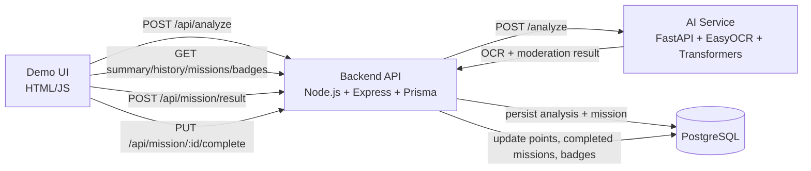

# AI Module to Turn Screen Time into Real Learning

Full technical documentation for the PFE project: a parental control platform that analyzes screenshots, detects risky content with local AI, and turns outcomes into age-aware educational missions and gamified progression.


## 1) Project Purpose

This system transforms passive screen time into guided real-world learning:

- analyzes screenshot content with OCR and AI moderation
- detects potentially harmful or inappropriate signals (text + visual)
- generates missions based on risk level
- uses reward logic, parent validation, badges, and levels to drive healthy behavior
- keeps the backend/AI contract stable for reliable integration

## 2) Architecture Overview



## 3) Repository Structure

- `backend/`: Express API, business logic, Prisma schema/migrations/seed, Jest tests
- `ai-service/`: FastAPI OCR + moderation + vision service, evaluation script, pytest tests
- `demo/`: single-page HTML interface to exercise the full flow
- `android-app/`: Flutter Android client that detects target apps (usage stats), captures the screen (MediaProjection), compresses, and uploads `POST /api/analyze` in the background — see [`android-app/README.md`](android-app/README.md) (vendored `media_projection_creator` + patched `media_projection_screenshot` for Android 14/15, including one reused `VirtualDisplay` per session for repeated `takeCapture`; manifest `FOREGROUND_SERVICE_MEDIA_PROJECTION`; scroll-safe layout when the keyboard is open).
- `scripts/`: cross-stack test runner (`run-all-tests.js`, `run_tests.sh`)
- `.husky/`: pre-commit test hook

## 4) End-to-End Functional Pipeline

1. Client sends `POST /api/analyze` with `{ userId, age, image? }`.
2. If no image is provided, backend returns a safe preview (`riskScore: 0`) and does not persist analysis.
3. If image is present, backend calls AI service `/analyze`.
4. AI service decodes base64 image, runs OCR, then combines:
   - text moderation (zero-shot classifier, fallback rules on failure)
   - optional visual NSFW moderation
5. AI result is normalized to:
   - `text`, `displayText`, `matchedKeywords`, `riskScore`, `category`
6. Backend creates `Analysis` + `Mission` (legacy text + optional structured interactive content).
7. Mission personalization uses user profile (`interests`, `engagementScore`, `age`) with risk-aware routing.
8. Points logic:
   - safe `real_world` missions (`riskScore < 0.3`): immediate points only if cooldown + daily cap allow it
   - interactive missions (`quiz`, `puzzle`, `mini_game`): points awarded via `POST /api/mission/result` using `base + bonus`
   - parent completion endpoint keeps `completedMissions` logic and avoids double-point award for interactive missions
9. Badge logic runs on point, mission-completion, and age conditions.
10. Engagement score is recalculated after each submitted mission result from recent outcomes.
11. Parent dashboard endpoints expose history, missions, summary, and earned badges.
12. Demo Analyze tab can render interactive widgets for mission types (`quiz`, `puzzle`, `mini_game`) and submit outcomes to `/api/mission/result`.

## 5) Backend (Node.js / Express / Prisma)

### 5.1 Entrypoints and Routing

- `backend/server.js`: loads `.env`, starts Express on `PORT` (default `3000`)
- `backend/src/app.js`:
  - `cors`
  - `express.json({ limit: "15mb" })` (supports large base64 payloads)
  - `morgan("dev")`
  - mounts router under `/api`
- `backend/src/routes/index.js`:
  - `/api/health`
  - `/api/analyze`
  - `/api/user`
  - `/api/mission`

### 5.2 Analyze Flow

Main file: `backend/src/services/analyzeService.js`

- validates and normalizes AI payload
- mission generation (personalized):
  - `selectMissionType(user, riskScore, category)` uses:
    - dangerous risk (`> 0.7`):
      - `games` interest -> `mini_game`
      - low engagement (`< 0.4`) -> `mini_game`
      - otherwise -> `quiz`
    - medium risk (`0.3–0.7`):
      - interests (`games` -> `mini_game`, `reading` -> `quiz`)
      - low engagement (`< 0.4`) -> `mini_game`
      - younger children (`age < 10`) -> `puzzle`
      - otherwise -> `real_world`
    - safe risk (`<= 0.3`) -> `real_world`
  - `computeDifficulty(user)` returns `1..3` from `engagementScore`
- mission persistence includes:
  - `mission` (legacy string text)
  - `type`, `content`, `difficulty`, `points`
- no-image path:
  - returns preview mission (`status: "preview"`)
  - does not write DB rows
- image path:
  - transaction creates/loads user, creates `Analysis`, creates `Mission`
  - safe immediate reward respects:
    - `SAFE_POINTS_COOLDOWN_MINUTES`
    - `SAFE_POINTS_DAILY_CAP`
    - daily reset using `lastSafeResetDate`
  - awards point badges when points effectively increase

### 5.3 Mission Completion Flow

Main file: `backend/src/services/missionService.js`

- endpoint: `PUT /api/mission/:id/complete`
- transactional checks:
  - mission exists
  - mission is not already completed
- updates:
  - mission `status = "completed"`
  - user points `+= mission.points + bonusPoints`
  - user `completedMissions += 1`
- then awards:
  - point badges
  - mission badges
- interactive mission safeguard:
  - for `quiz`/`puzzle`/`mini_game`, this endpoint increments `completedMissions` but does not award points (points are awarded by result submission)

### 5.4 Mission Result Submission Flow

Main files:

- `backend/src/services/missionResultService.js`
- `backend/src/controllers/missionResultController.js`
- `backend/src/routes/missionResultRoutes.js`

- endpoint: `POST /api/mission/result`
- transactional behavior:
  - validates mission ownership and mission state
  - computes `bonusPoints` from mission type + result data (`score`, `success`, `timeSpent`) and caps by `reward.maxBonus` when provided
  - creates `MissionResult`
  - auto-completes mission (`status = "completed"`)
  - increments user `points` by `earnedPoints = reward.basePoints + bonusPoints` (fallback to `mission.points` if reward is absent)
  - increments `completedMissions` by 1
  - updates `engagementScore` using recent mission results
  - triggers point and mission badge awarding

### 5.4.1 Engagement Score Formula

After each `POST /api/mission/result`, backend fetches the latest 10 mission results and computes:

- `completionRate = successes / total`
- `successRate = successes / total` (currently same signal, kept separate for future weighting changes)
- `streakFactor = min(consecutiveSuccesses / 10, 1)`
- `engagementScore = 0.4*completionRate + 0.3*successRate + 0.3*streakFactor`

This score is stored on `User.engagementScore` and then reused by personalization/difficulty logic.

### 5.5 User Read Endpoints

Main file: `backend/src/services/userService.js`

- `GET /api/user/:id/history?take=&skip=`:
  - paginated analyses + missions
- `GET /api/user/:id/missions?take=&skip=`:
  - paginated missions
- `GET /api/user/:id/badges`:
  - all earned badges with metadata and `awardedAt`
- `GET /api/user/:id/summary`:
  - points
  - total missions
  - dangerous analyses count
  - average risk score
  - level fields:
    - `level = floor(sqrt(points / 100)) + 1`
    - `pointsToNextLevel = 100 * (baseLevel + 1)^2 - points`
  - triggers age badge awarding based on current `age`
- `GET /api/user/:id/profile`:
  - compact profile payload for demo personalization controls:
    - `id`, `age`, `points`
    - `interests` (normalized string array)
    - `engagementScore`
- `PUT /api/user/:id/interests`:
  - request body: `{ "interests": ["games", "reading", ...] }`
  - accepts and persists only allowed values:
    - `games`, `reading`, `science`, `sports`, `art`, `music`, `technology`, `logic`, `creativity`
  - normalizes to lowercase and removes duplicates
- `PUT /api/user/:id/age`:
  - request body: `{ "age": 12 }` (JSON number, integer, `0`–`120`)
  - updates `User.age` and returns `{ success, user }` with the same compact profile fields as `GET /api/user/:id/profile`

### 5.6 Badge Service

Main file: `backend/src/services/badgeService.js`

- idempotent awarding with `createMany(..., skipDuplicates: true)`
- types:
  - `POINT`: threshold crossing from previous to new points
  - `MISSION`: threshold crossing from previous to new completed-mission count
  - `AGE`: range matching (`6-9`, `10-12`, `13-17`, `18+`)
- supports optional transaction client (`tx`) for atomic operations

### 5.7 Prisma and Data Layer

- Prisma client singleton:
  - `backend/src/config/prisma.js`
  - dev global reuse avoids client duplication during reload
- schema:
  - `backend/prisma/schema.prisma`
- migrations:
  - `backend/prisma/migrations/*`
- seed:
  - `backend/prisma/seed.js`
  - inserts/updates 14 badges idempotently

## 6) AI Service (FastAPI / EasyOCR / Transformers)

### 6.1 Entrypoint and API Contract

Main file: `ai-service/app/main.py`

- `POST /analyze` input:
  - `{ "image": "<base64>" }`
  - accepts raw base64 and `data:image/...;base64,...`
- response contract (stable):

```json
{
  "text": "string",
  "displayText": "string",
  "matchedKeywords": ["string"],
  "riskScore": 0.82,
  "category": "safe | risky | dangerous"
}
```

- `GET /health`: liveness check

### 6.2 Startup Behavior

At startup (`@app.on_event("startup")`):

- logs torch and CUDA availability
- attempts CUDA warmup
- preloads EasyOCR reader (best-effort)
- initializes moderation model synchronously with timeout
- if model init fails:
  - service still runs in degraded mode
  - moderation falls back to deterministic rule engine

### 6.3 OCR Layer

Main file: `ai-service/app/services/ocr_service.py`

- EasyOCR reader singleton
- language set: `["en", "fr"]`
- GPU used only when CUDA is truly usable
- image thumbnail to `1280x1280` before OCR

### 6.4 Text Moderation Layer

Main file: `ai-service/app/services/moderation_service.py`

- model: `MoritzLaurer/mDeBERTa-v3-base-mnli-xnli` (zero-shot)
- candidate moderation labels:
  - self-harm
  - violence
  - hate speech
  - harassment
  - sexual content
  - threat
- pipeline behavior:
  - multi-label zero-shot classification
  - cached results (`lru_cache`) to reduce repeated inference costs
  - risk score = highest label score (clamped and rounded)
  - `matchedKeywords` = labels above `MATCHED_KEYWORDS_THRESHOLD`
- fallback conditions:
  - empty OCR text
  - very short OCR text
  - classifier unavailable/degraded
  - runtime inference exception
- fallback result includes explicit `fallback_reason` internally

### 6.5 Rule-Based Fallback

Main file: `ai-service/app/services/risk_scoring.py`

- deterministic signal rules with weights
- supports:
  - regex patterns
  - context windows
  - OCR-tolerant fuzzy token matching (Levenshtein)
- covers categories such as:
  - self-harm
  - violent threat
  - weapon
  - dangerous challenge
  - hate speech
  - abusive toxicity
- outputs:
  - matched signals
  - risk score
  - display text with canonicalized fuzzy tokens

### 6.6 Vision Layer

Main file: `ai-service/app/services/vision_service.py`

- default model: `Ateeqq/nsfw-image-detection`
- lazy-loaded classifier, GPU if available
- model classes used by service:
  - `nudity_pornography` (mapped to NSFW)
  - `gore_bloodshed_violent` (mapped to violence)
  - `safe_normal`
- model fallback candidates at load time:
  - configured `VISION_MODEL_NAME`
  - `Ateeqq/nsfw-image-detection`
  - `Falconsai/nsfw_image_detection` (NSFW-only fallback)
- returns:
  - `riskScore = max(nsfw_score, violence_score)`
  - `matchedKeywords`:
    - `nsfw visual` when `nsfw_score > VISION_MATCHED_KEYWORDS_THRESHOLD`
    - `violence visual` when `violence_score > VISION_MATCHED_KEYWORDS_THRESHOLD`
- fail-safe behavior: on exception, returns zero visual risk

### 6.7 Orchestration

Main file: `ai-service/app/services/analysis_orchestrator.py`

- merges text moderation and vision moderation
- final risk is `max(textRisk, visionRisk)`
- final keywords are concatenated text + vision indicators
- category mapped from final risk using configured thresholds

## 7) Database Schema Summary

Defined in `backend/prisma/schema.prisma`.

### 7.1 User

- identity and profile:
  - `id`, `age`, `createdAt`
- personalization:
  - `interests` (JSON array, default `[]`)
  - `engagementScore` (float, default `0.5`)
- progression:
  - `points`, `completedMissions`
- anti-farming for safe rewards:
  - `lastSafeMissionAt`
  - `safePointsToday`
  - `lastSafeResetDate`

### 7.2 Analysis

- moderation record:
  - raw OCR `text`
  - parent-facing `displayText`
  - `matchedKeywords` JSON
  - `riskScore`, `category`
  - `usedAI` flag

### 7.3 Mission

- generated mission text and intended points
- interactive metadata:
  - `type` (`real_world`, `quiz`, `puzzle`, `mini_game`)
  - `content` (JSON payload for app-side rendering/game rules)
  - `difficulty` (1-3)
- status lifecycle:
  - default `pending`
  - `completed` after parent validation

### 7.4 MissionResult

- stores submitted mission performance:
  - `score`
  - `success`
  - `timeSpent`
  - `bonusPoints`
  - `earnedPoints`
- links each result to mission and user
- used to track interactive outcomes and reward transparency

### 7.5 Badge / UserBadge

- `Badge`: catalog (`name`, `type`, `requirementValue`, description)
- `UserBadge`: earned relation with `awardedAt`
- uniqueness: one badge can be earned once per user (`@@unique([userId, badgeId])`)

## 8) API Surface

### 8.1 Backend API (`http://localhost:3000/api`)

- `GET /health`
- `POST /analyze`
  - body: `{ userId, age, image? }`
- `GET /user/:id/history?take=20&skip=0`
- `GET /user/:id/missions?take=100&skip=0`
- `GET /user/:id/badges`
- `GET /user/:id/summary`
- `PUT /mission/:id/complete`
  - body: `{ bonusPoints: 0 }` (optional, non-negative integer)
- `POST /mission/result`
  - body: `{ missionId, userId, success, score?, timeSpent? }`
  - awards `earnedPoints = base mission points + calculated bonus`

### 8.3 Mission JSON Contract (Flutter-ready)

Each mission returned by `POST /api/analyze` includes:

- top-level:
  - `type`
  - `game` (nullable for non-game missions)
  - `difficulty`
  - `points` (legacy/base points)
  - `mission` (legacy text used by existing demo UI)
- structured payload:
  - `content.title`
  - `content.instructions`
  - `content.data` (game-specific payload)
  - `content.reward = { basePoints, maxBonus }`

Backward compatibility:

- `mission.mission` is always preserved for existing consumers.
- existing game fields (`question`, `choices`, `correctAnswer`, `grid`, `game`, etc.) remain available in `content` for legacy renderers.

### 8.4 Flutter Integration Mapping

Recommended widget routing:

- `type = quiz`, `game = quiz` -> quiz card / multiple-choice widget
- `type = puzzle`, `game = sudoku4x4` -> sudoku widget
- `type = mini_game`, `game = tic_tac_toe` -> tic-tac-toe widget
- `type = real_world` -> task card using `mission` + `content.instructions`

Reward display in Flutter:

- show base reward from `content.reward.basePoints`
- show bonus cap from `content.reward.maxBonus`
- compute total at result time using backend response from `POST /api/mission/result`

### 8.1.1 Demo interactive mission widget behavior

- file: `demo/index.html` (Analyze tab)
- keeps legacy mission text rendering (`mission.mission`) unchanged
- when mission type is interactive:
  - `quiz` -> renders option cards with a check-answer step and feedback before submit
  - `puzzle` with `sudoku4x4` -> renders 4x4 sudoku with check/reset/hint controls and per-cell feedback (`.sudoku-table` CSS: high-contrast cells, clue vs editable styling, 55px inputs with light shadow)
  - **Sudoku widget (demo):** when the mission payload has both `grid` and `solution` (e.g. `content.data` or legacy `content`), the demo uses them; otherwise it generates a **random valid 4×4** puzzle in the browser (`difficulty` 1–3 removes 6 / 8 / 10 cells). The same generated puzzle is kept for **Reset** until a new analyze run clears the widget. **Hint** fills a **random** empty editable cell from the stored solution; **Check** marks cells correct/incorrect against that solution before **Submit**.
  - `mini_game` -> renders tic-tac-toe with reset/play-again controls and explicit end-state messaging
- submits game outcome to `POST /api/mission/result` and then refreshes summary/history
- accessibility/readability hardening:
  - game widget content uses explicit dark text on light background to avoid invisible quiz labels in dark theme context
- child-friendly UX additions:
  - points preview shown in the widget (`mission.points`)
  - in-widget timer from mission start to submission
  - restart button resets only the game UI/state without requiring a new analyze request

### 8.1.2 Demo profile tab (interests editor)

- file: `demo/index.html` (`Profile` tab)
- supports:
  - loading a user profile by id (`GET /api/user/:id/profile`)
  - showing current `engagementScore`, age, and points
  - editing age with **Save age** (`PUT /api/user/:id/age`) so medium-risk personalization (e.g. `age < 10` → puzzle) is easy to demo
  - selecting interests from predefined checkboxes
  - saving interests via `PUT /api/user/:id/interests`
- purpose:
  - exposes personalization inputs in the demo without altering mission-generation logic

### 8.2 AI API (`http://127.0.0.1:8000`)

- `GET /health`
- `GET /ready`
  - strict readiness for AI components
  - returns:
    - `status`: `ready` or `loading`
    - `ocr_loaded`
    - `moderation_model_loaded`
    - `vision_model_loaded`
    - `gpu_available`
- `POST /analyze`
  - body: `{ image: "<base64>" }`

## 9) Configuration

### 9.1 Backend Environment (`backend/.env`)

From `backend/.env.example`:

- `PORT=3000`
- `DATABASE_URL=postgresql://...`
- `AI_ANALYZE_URL=http://127.0.0.1:8000/analyze`
- `AI_REQUEST_TIMEOUT_MS=120000`
- `SAFE_POINTS_COOLDOWN_MINUTES=5`
- `SAFE_POINTS_DAILY_CAP=10`

### 9.2 AI Environment (`ai-service` process env)

From `ai-service/app/config.py`:

- `MODERATION_MODEL_NAME`
- `MODERATION_HYPOTHESIS_TEMPLATE`
- `MODERATION_RISKY_THRESHOLD`
- `MODERATION_DANGEROUS_THRESHOLD`
- `MODERATION_MATCHED_KEYWORDS_THRESHOLD`
- `MODERATION_SHORT_TEXT_FALLBACK_THRESHOLD`
- `MODERATION_CACHE_SIZE`
- `MODERATION_STARTUP_MODEL_LOAD_TIMEOUT_SECONDS`
- `VISION_MODEL_NAME` (default `Ateeqq/nsfw-image-detection`)
- `VISION_MATCHED_KEYWORDS_THRESHOLD` (default `0.5`)

### 9.3 Test Runner Environment

Used by `scripts/run-all-tests.js`:

- `AI_VENV_PYTHON` (absolute path to Python executable in venv)
- `PYTHON_FOR_TESTS` (fallback variable)

## 10) Local Development Setup

## 10.1 Prerequisites

- Node.js 18+
- Python 3.10+ (recommended)
- PostgreSQL
- Git

### 10.2 Backend Setup

```bash
cd backend
npm install
```

Configure `backend/.env`, then:

```bash
npx prisma generate
npx prisma migrate dev
npm run db:seed
npm run dev
```

### 10.3 AI Service Setup

```bash
cd ai-service
python -m venv .venv
```

Windows PowerShell:

```powershell
.\.venv\Scripts\Activate.ps1
pip install -r requirements.txt
.\run-dev.ps1
```

### 10.4 Demo Setup

Open `demo/index.html` directly, or serve it with a static server.

Example:

```bash
cd demo
python -m http.server 8080
```

Then open `http://localhost:8080`.

## 11) Testing Strategy

### 11.1 One-Command Cross-Stack Tests

From repository root:

```bash
node scripts/run-all-tests.js
```

This runs:

1. backend Jest suite
2. AI pytest suite

Optional strict evaluation:

```bash
node scripts/run-all-tests.js --full
```

Adds `ai-service/evaluate_moderation.py --strict` over `moderation_eval_dataset.json`.

### 11.2 Backend Test Coverage

Tests in `backend/src/services/__tests__/` cover:

- `analyzeService` mission mapping, reward conditions, cooldown/cap behavior
- `missionService` completion edge cases and reward transfer
- `missionResultService` bonus calculation, result submission, auto-completion, and points/badge updates
- `badgeService` threshold and age badge awarding
- `userService` summary fields and badge retrieval
- `aiService` HTTP client behavior and error handling

### 11.3 AI Test Coverage

Tests in `ai-service/tests/` cover:

- moderation service behavior
- vision service behavior
- shared fixtures in `conftest.py`

## 12) Operational Notes and Trade-offs

- first startup can be slow due to model downloads
- AI service keeps local inference only (no external moderation API dependency)
- fallback is deterministic and available offline
- use `/health` for liveness and `/ready` for strict model/OCR readiness
- backend tolerates long AI inference with large timeout
- mission reward logic intentionally separates child actions from parent-controlled validation for risky content

## 13) Production Hardening Checklist

- add structured logging with correlation IDs across backend and AI service
- extend readiness to include optional dependency/DB connectivity checks
- enforce request auth and per-user authorization
- add rate limits and abuse protection
- add DB indexes for heavy pagination queries
- containerize backend + ai-service + db with explicit startup ordering
- centralize observability (metrics/traces), especially inference latency and fallback rates

## 14) Key Technical Files

- Backend app bootstrap: `backend/server.js`, `backend/src/app.js`
- Backend routes: `backend/src/routes/index.js`
- Analyze logic: `backend/src/services/analyzeService.js`
- Mission completion: `backend/src/services/missionService.js`
- User aggregation: `backend/src/services/userService.js`
- Badge engine: `backend/src/services/badgeService.js`
- Prisma schema/migrations/seed: `backend/prisma/`
- AI entrypoint: `ai-service/app/main.py`
- OCR: `ai-service/app/services/ocr_service.py`
- Moderation: `ai-service/app/services/moderation_service.py`
- Rule fallback: `ai-service/app/services/risk_scoring.py`
- Vision moderation: `ai-service/app/services/vision_service.py`
- Orchestrator: `ai-service/app/services/analysis_orchestrator.py`
- Demo UI: `demo/index.html`
- Test runner: `scripts/run-all-tests.js`

